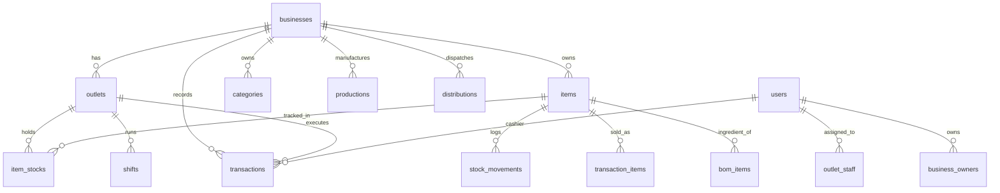

# DATABASE_SNAPSHOT.md — Live Snapshot Database PostgreSQL

> **Database Host & Port**: `localhost:5432` / Database: `andaya_group`  
> **Target Engine**: PostgreSQL 14+ (Go Fiber + pgxpool)  
> **Arsitektur**: The Lean Odoo Way (Unified 3NF, Append-Only Double Entry Ledger, Capability Flags)  
> **Waktu Pembaruan**: September 2026

---

## 1. Rangkuman Tabel & Row Count

Total **34 Tabel** pada skema `public`:

| No | Nama Tabel | Row Count | Kategori Domain | Deskripsi & Peran Arsitektur |
|:---:|---|:---:|---|---|
| 1 | `users` | **12** | Core Auth | Pengguna sistem (Superadmin, Owner, Manager, Staff Kasir, Admin Gudang). |
| 2 | `businesses` | **4** | Core Multi-Tenant | 4 Unit Bisnis dengan Capability Flags (`has_pos`, `has_manufacturing`, `has_multi_outlets`, dll). |
| 3 | `outlets` | **8** | Core Multi-Tenant | Toko fisik, dapur pusat, gudang transit, dan titik gerobak lapangan. |
| 4 | `business_owners` | **4** | Core Multi-Tenant | Pemetaan kepemilikan bisnis multi-tenant (Many-to-Many). |
| 5 | `outlet_staff` | **9** | Core RBAC | Penugasan akun staff/manager ke outlet operasional. |
| 6 | `manager_pins` | **4** | Security / Auth | Hash PIN otorisasi Manager Override (Void, Retur, Approval). |
| 7 | `categories` | **10** | Master Data | Kategori produk jadi, bahan baku, dan barang konsumsi per tenant. |
| 8 | `items` | **20** | Unified Master | **[Active 3NF]** Master Item terpadu + Dual-UOM (`conversion_rate`) & `requires_thaw`. |
| 9 | `item_stocks` | **24** | Stock Balance | **[Active 3NF]** Saldo stok fisik Dual-UOM (`qty_sealed` dus/pack & `qty_loose` eceran). |
| 10 | `stock_movements` | **15** | Inventory Ledger | **[Active 3NF]** Buku besar mutasi inventaris *double-entry / append-only*. |
| 11 | `shifts` | **2** | POS Commercial | Sesi register kasir buka/tutup kas (`opening_cash`, `closing_cash_actual`). |
| 12 | `transactions` | **1** | Sales Ledger | Header transaksi penjualan universal (`channel`: `pos_retail`, `pos_fnb`, dll). |
| 13 | `transaction_items` | **4** | Sales Ledger | Rincian baris item barang terjual, harga, diskon, dan snapshot modal HPP. |
| 14 | `promotions` | **4** | Pricing Engine | Program promosi & diskon rule-based (`discount_pct`, `discount_fixed`, `coupon`). |
| 15 | `promotion_targets` | **1** | Pricing Engine | Relasi target item/kategori spesifik yang berhak atas diskon promosi. |
| 16 | `boms` | **1** | Manufacturing | Formula resep Bill of Materials produksi dapur (output item & yield). |
| 17 | `bom_items` | **3** | Manufacturing | Rincian bahan baku dan takaran per batch output BOM. |
| 18 | `productions` | **1** | Manufacturing | Batch work order dapur pusat, snapshot HPP per unit, dan status produksi. |
| 19 | `production_expenses` | **3** | Manufacturing | Pemotongan atomik bahan baku yang terpakai pada setiap batch produksi. |
| 20 | `stock_transfers` | **7** | Logistics (Header) | **[Active 3NF]** Header Surat Jalan pengiriman transfer antar-cabang (`transfer_no`: `SJ-YYYYMMDD-001`). |
| 21 | `stock_transfer_items` | **13** | Logistics (Lines) | **[Active 3NF]** Baris rincian multi-item pengiriman barang, kuantitas Dus/Pcs, dan toleransi susut. |
| 22 | `thaw_logs` | **0** | Logistics / QC | Catatan pencairan stok beku (`qty_sealed` $\rightarrow$ `qty_loose`), susut es, dan QC pagi. |
| 23 | `eod_material_usages` | **2** | Manufacturing | Lembar konsumsi bahan baku curah harian akhir hari (Gorengan Andalan). |
| 24 | `daily_settlements` | **1** | Settlements | Header penutupan sesi harian & rekonsiliasi kas/QRIS gerobak mitra. |
| 25 | `daily_settlement_items` | **1** | Settlements | Detail porsi/butir terjual pada penutupan sesi harian gerobak. |
| 26 | `opname_sessions` | **1** | Stock Audit | Sesi audit fisik stok gudang/toko berjalan (`open`, `completed`). |
| 27 | `opname_items` | **2** | Stock Audit | Rincian selisih stok sistem vs hitungan aktual fisik opname. |
| 28 | `procurements` | **1** | Procurement | Faktur pembelian supplier, jatuh tempo hutang (`purchases`), dan status bayar. |
| 29 | `procurement_items` | **2** | Procurement | Detail item barang masuk dari pembelian supplier. |
| 30 | `products` | **13** | Legacy Master | Master produk siap jual legacy (backward compatibility view). |
| 31 | `ingredients` | **0** | Legacy Master | Master bahan baku legacy (telah diserap penuh ke `items`). |
| 32 | `stock_batches` | **0** | Inventory Batch | Batch nomor kedaluwarsa & perishable tracking. |
| 33 | `wastage_logs` | **0** | Inventory Scrap | Pencatatan barang rusak/dibuang (*stock scrap* & QC Discard). |
| 34 | `audit_logs` | **0** | Security Audit | Jejak audit keamanan sistem dan perubahan data kritikal. |

---

## 2. Struktur Rinci Database per Tabel



---

### A. Core Multi-Tenant & RBAC

#### 1. `users`
| Kolom | Tipe Data | Nullable | Default / Constraint | Keterangan |
|---|---|:---:|---|---|
| `id` | `UUID` | NO | `gen_random_uuid()` / **PK** | Identifier unik pengguna. |
| `name` | `VARCHAR(150)` | NO | - | Nama lengkap staf/owner. |
| `phone_or_email` | `VARCHAR(100)` | YES | `UNIQUE` | Akun login (Email `@gmail.com` / No HP). |
| `password_hash` | `VARCHAR(255)` | YES | - | Hash bcrypt password (Owner/Manager). |
| `pin_hash` | `VARCHAR(255)` | YES | - | Hash bcrypt PIN 6-digit (Kasir Staff). |
| `status` | `user_status` | NO | `'active'` | Status (`active`, `inactive`, `discontinued`). |
| `created_at` | `TIMESTAMPTZ` | NO | `NOW()` | Waktu registrasi akun. |
| `updated_at` | `TIMESTAMPTZ` | NO | `NOW()` | Waktu pembaruan akun. |

#### 2. `businesses`
| Kolom | Tipe Data | Nullable | Default / Constraint | Keterangan |
|---|---|:---:|---|---|
| `id` | `UUID` | NO | `gen_random_uuid()` / **PK** | Identifier unik unit bisnis. |
| `name` | `VARCHAR(100)` | NO | - | Nama entitas bisnis (JnA Mart, Bakso Gemoy, dll). |
| `type` | `VARCHAR(50)` | NO | - | Format tipe bisnis (`retail`, `fnb_production`, dll). |
| `has_pos` | `BOOLEAN` | NO | `TRUE` | **Capability Flag**: Modul POS Kasir Aktif. |
| `has_manufacturing`| `BOOLEAN` | NO | `FALSE` | **Capability Flag**: Modul Dapur & Resep BOM Aktif. |
| `has_logistics_hub`| `BOOLEAN` | NO | `FALSE` | **Capability Flag**: Modul Hub Surat Jalan Aktif. |
| `has_eod_usage` | `BOOLEAN` | NO | `FALSE` | **Capability Flag**: Lembar Konsumsi Bahan Curah. |
| `has_multi_outlets`| `BOOLEAN` | NO | `FALSE` | **Capability Flag**: Multi-Cabang & Routing Distribusi Aktif (False = Single-Outlet Ringan). |
| `phone` | `VARCHAR(50)` | YES | - | Kontak telepon bisnis. |
| `email` | `VARCHAR(100)` | YES | - | Kontak email resmi bisnis. |
| `tax_id` | `VARCHAR(50)` | YES | - | NPWP / Nomor pokok pajak. |
| `tax_rate_pct` | `NUMERIC(5,2)` | NO | `0.00` | Tarif PPN bawaan transaksi bisnis. |
| `created_at` | `TIMESTAMPTZ` | NO | `NOW()` | Tanggal pendirian sistem bisnis. |
| `updated_at` | `TIMESTAMPTZ` | NO | `NOW()` | Tanggal pembaruan konfigurasi. |

#### 3. `outlets`
| Kolom | Tipe Data | Nullable | Default / Constraint | Keterangan |
|---|---|:---:|---|---|
| `id` | `UUID` | NO | `gen_random_uuid()` / **PK** | Identifier unik outlet fisik / gerobak. |
| `business_id` | `UUID` | NO | `FK -> businesses(id)` | Relasi unit bisnis induk. |
| `name` | `VARCHAR(100)` | NO | - | Nama outlet/toko/gerobak. |
| `address` | `TEXT` | YES | - | Alamat fisik lokasi outlet. |
| `phone` | `VARCHAR(50)` | YES | - | Nomor kontak outlet. |
| `receipt_footer` | `TEXT` | YES | - | Catatan footer struk belanja kasir. |
| `created_at` | `TIMESTAMPTZ` | NO | `NOW()` | Waktu pembuatan data outlet. |
| `updated_at` | `TIMESTAMPTZ` | NO | `NOW()` | Waktu pembaruan outlet. |

#### 4. `business_owners`
| Kolom | Tipe Data | Nullable | Default / Constraint | Keterangan |
|---|---|:---:|---|---|
| `id` | `UUID` | NO | `gen_random_uuid()` / **PK** | Identifier relasi kepemilikan. |
| `user_id` | `UUID` | NO | `FK -> users(id)` | Akun Owner. |
| `business_id` | `UUID` | YES | `FK -> businesses(id)` | Bisnis yang dimiliki (Level Holding). |
| `outlet_id` | `UUID` | YES | `FK -> outlets(id)` | Outlet spesifik (Level Franchise). |
| `created_at` | `TIMESTAMPTZ` | NO | `NOW()` | Tanggal penugasan hak pemilik. |

#### 5. `outlet_staff`
| Kolom | Tipe Data | Nullable | Default / Constraint | Keterangan |
|---|---|:---:|---|---|
| `id` | `UUID` | NO | `gen_random_uuid()` / **PK** | Identifier relasi penugasan. |
| `user_id` | `UUID` | NO | `FK -> users(id)` | Akun staf yang ditugaskan. |
| `outlet_id` | `UUID` | NO | `FK -> outlets(id)` | Outlet tempat staf bertugas. |
| `role` | `staff_role` | NO | - | Peran (`manager`, `admin_gudang`, `staff`). |
| `can_view_cost` | `BOOLEAN` | NO | `FALSE` | Izin melihat HPP / harga modal supplier. |
| `status` | `user_status` | NO | `'active'` | Status penugasan aktif/nonaktif. |
| `created_at` | `TIMESTAMPTZ` | NO | `NOW()` | Tanggal staf mulai bertugas. |
| `updated_at` | `TIMESTAMPTZ` | NO | `NOW()` | Tanggal pembaruan penugasan. |

---

### B. Master Items, Dual-UOM & Inventori Ledger (3NF)

#### 6. `items` (Unified Master Table)
| Kolom | Tipe Data | Nullable | Default / Constraint | Keterangan |
|---|---|:---:|---|---|
| `id` | `UUID` | NO | `gen_random_uuid()` / **PK** | Identifier unik master item. |
| `business_id` | `UUID` | NO | `FK -> businesses(id)` | Tenant scoping isolasi bisnis. |
| `category_id` | `UUID` | YES | `FK -> categories(id)` | Kategori klasifikasi barang. |
| `sku` | `VARCHAR(50)` | YES | - | Barcode scan / Kode SKU unik. |
| `name` | `VARCHAR(150)` | NO | - | Nama resmi barang / menu. |
| `item_type` | `VARCHAR(30)` | NO | `'finished_good'` | `finished_good`, `raw_material`, `consumable`. |
| `is_sellable` | `BOOLEAN` | NO | `TRUE` | Apakah tampil di POS kasir penjualan. |
| `is_inventory_tracked`| `BOOLEAN`| NO | `TRUE` | Apakah mutasi dicatat di `stock_movements`. |
| `requires_thaw` | `BOOLEAN` | NO | `FALSE` | Apakah memerlukan alur pencairan beku & QC. |
| `base_unit` | `VARCHAR(20)` | NO | `'pcs'` | Satuan terkecil eceran (pcs, butir, kg, porsi). |
| `box_unit` | `VARCHAR(20)` | YES | - | Satuan kemasan besar (dus, pack, karton, sak). |
| `conversion_rate` | `NUMERIC(14,4)`| NO | `1.0000` | **Dual-UOM Ratio**: 1 Box = X Base Units. |
| `price_unit` | `VARCHAR(20)` | NO | `'base'` | Satuan harga patokan (`base` / `box`). |
| `sell_price` | `BIGINT` | NO | `0` | Harga jual eceran (`base_unit`) di POS. |
| `box_sell_price`| `BIGINT` | NO | `0` | Harga jual grosir per-dus/pack (`box_unit`). |
| `standard_cost` | `BIGINT` | NO | `0` | HPP Modal dasar / harga beli supplier. |
| `min_stock_alert`| `NUMERIC(14,4)`| YES| `5.0000` | Batas minimum peringatan stok menipis. |
| `image_url` | `TEXT` | YES | - | URI foto produk katalog. |
| `status` | `VARCHAR(20)` | NO | `'active'` | Status (`active`, `inactive`, `discontinued`). |
| `created_at` | `TIMESTAMPTZ` | NO | `NOW()` | Waktu pendaftaran master item. |
| `updated_at` | `TIMESTAMPTZ` | NO | `NOW()` | Waktu pembaruan item. |

#### 7. `item_stocks` (Physical Inventory Balance)
| Kolom | Tipe Data | Nullable | Default / Constraint | Keterangan |
|---|---|:---:|---|---|
| `id` | `UUID` | NO | `gen_random_uuid()` / **PK** | Identifier baris saldo stok. |
| `item_id` | `UUID` | NO | `FK -> items(id)` | Relasi barang master. |
| `outlet_id` | `UUID` | NO | `FK -> outlets(id)` | Lokasi toko/gudang/gerobak fisik. |
| `held_by_user_id`| `UUID` | YES | `FK -> users(id)` | Staf pemegang barang (Mobile Cart Holding). |
| `qty_sealed` | `NUMERIC(14,4)`| NO | `0.0000` | Saldo kemasan utuh bersegel (Dus / Pack Beku). |
| `qty_loose` | `NUMERIC(14,4)`| NO | `0.0000` | Saldo eceran terbuka (Pcs / Butir Siap Jual). |
| `updated_at` | `TIMESTAMPTZ` | NO | `NOW()` | Waktu mutasi saldo terakhir. |

#### 8. `stock_movements` (Append-Only Double Entry Ledger)
| Kolom | Tipe Data | Nullable | Default / Constraint | Keterangan |
|---|---|:---:|---|---|
| `id` | `UUID` | NO | `gen_random_uuid()` / **PK** | Identifier unik entri jurnal stok. |
| `business_id` | `UUID` | NO | `FK -> businesses(id)` | Tenant scoping isolasi. |
| `item_id` | `UUID` | NO | `FK -> items(id)` | Barang yang bermutasi. |
| `source_document_type`| `VARCHAR(50)`| NO | - | Dokumen asal (`pos_sale`, `distribution_outbound`, dll). |
| `source_document_id` | `UUID` | YES | - | ID transaksi / surat jalan / order asal. |
| `from_location_type` | `VARCHAR(30)`| NO | - | Tipe asal (`outlet`, `supplier`, `transit`, `kitchen`). |
| `from_outlet_id` | `UUID` | YES | `FK -> outlets(id)` | Outlet pengirim/pengurang stok. |
| `to_location_type` | `VARCHAR(30)`| NO | - | Tipe tujuan (`outlet`, `customer`, `scrap_waste`). |
| `to_outlet_id` | `UUID` | YES | `FK -> outlets(id)` | Outlet penerima stok. |
| `package_form` | `VARCHAR(20)`| NO | `'loose'` | Wujud barang (`sealed`, `loose`, `mixed`). |
| `qty` | `NUMERIC(14,4)`| NO | - | Kuantitas mutasi riil. |
| `unit_cost` | `BIGINT` | NO | `0` | HPP modal per satuan saat mutasi terjadi. |
| `total_cost` | `BIGINT` | NO | `0` | Total nominal modal yang berpindah. |
| `performed_by` | `UUID` | NO | `FK -> users(id)` | Akun user yang mengeksekusi aksi mutasi. |
| `notes` | `TEXT` | YES | - | Keterangan jejak audit mutasi. |
| `created_at` | `TIMESTAMPTZ` | NO | `NOW()` | Waktu transaksi pembukuan. |

---

### C. Commercial POS, Sessions & Diskon Promosi

#### 9. `shifts` (Cashier Sessions)
| Kolom | Tipe Data | Nullable | Default / Constraint | Keterangan |
|---|---|:---:|---|---|
| `id` | `UUID` | NO | `gen_random_uuid()` / **PK** | Identifier sesi kasir register. |
| `outlet_id` | `UUID` | NO | `FK -> outlets(id)` | Outlet tempat kasir bertugas. |
| `user_id` | `UUID` | NO | `FK -> users(id)` | Akun kasir penanggung jawab shift. |
| `opening_cash` | `BIGINT` | NO | `0` | Modal kas awal laci kasir (uang kembalian). |
| `closing_cash_actual`| `BIGINT`| YES| - | Kas riil hasil hitungan fisik saat tutup shift. |
| `closing_cash_system`| `BIGINT`| YES| - | Total kas yang tercatat oleh sistem POS. |
| `cash_difference`| `BIGINT` | YES | - | Selisih kas (`actual - system`). |
| `status` | `VARCHAR(20)` | NO | `'open'` | Status sesi (`open`, `closed`). |
| `started_at` | `TIMESTAMPTZ` | NO | `NOW()` | Waktu buka laci register. |
| `ended_at` | `TIMESTAMPTZ` | YES | - | Waktu tutup shift register. |
| `notes` | `TEXT` | YES | - | Catatan penutupan shift. |

#### 10. `transactions` (Universal Sales Ledger)
| Kolom | Tipe Data | Nullable | Default / Constraint | Keterangan |
|---|---|:---:|---|---|
| `id` | `UUID` | NO | `gen_random_uuid()` / **PK** | Identifier unik transaksi penjualan. |
| `client_uuid` | `UUID` | YES | `UNIQUE` | UUID idempotency offline-first. |
| `business_id` | `UUID` | NO | `FK -> businesses(id)` | Tenant scoping isolasi. |
| `outlet_id` | `UUID` | NO | `FK -> outlets(id)` | Outlet tempat transaksi terjadi. |
| `shift_id` | `UUID` | YES | `FK -> shifts(id)` | Sesi kasir shift berjalan. |
| `cashier_id` | `UUID` | NO | `FK -> users(id)` | Staf kasir yang melayani. |
| `customer_id` | `UUID` | YES | `FK -> users(id)` | Akun member / pelanggan (opsional). |
| `channel` | `VARCHAR(30)` | NO | `'pos_retail'` | Kanal (`pos_retail`, `pos_fnb`, `direct_wholesale`). |
| `type` | `tx_type` | NO | `'sale'` | Tipe transaksi (`sale`, `return`, `waste`). |
| `payment_method` | `payment_method`| NO | - | Metode bayar (`cash`, `qris`, `bank_transfer`, `debt`). |
| `subtotal` | `BIGINT` | NO | `0` | Total kotor belanjaan. |
| `tax_amount` | `BIGINT` | NO | `0` | Nominal PPN terhitung. |
| `discount_amount`| `BIGINT` | NO | `0` | Total potongan diskon promosi. |
| `total_amount` | `BIGINT` | NO | `0` | Total bersih yang dibayar pelanggan. |
| `debt_due_date` | `DATE` | YES | - | Tanggal jatuh tempo jika bayar tempo/hutang. |
| `promotion_id` | `UUID` | YES | `FK -> promotions(id)` | Program promosi yang diterapkan. |
| `created_at` | `TIMESTAMPTZ` | NO | `NOW()` | Waktu cetak struk pembayaran. |

#### 11. `transaction_items`
| Kolom | Tipe Data | Nullable | Default / Constraint | Keterangan |
|---|---|:---:|---|---|
| `id` | `UUID` | NO | `gen_random_uuid()` / **PK** | Identifier baris belanjaan. |
| `transaction_id` | `UUID` | NO | `FK -> transactions(id)`| Relasi transaksi induk. |
| `item_id` | `UUID` | YES | `FK -> items(id)` | Barang yang dibeli. |
| `sku` | `VARCHAR(50)` | YES | - | Snapshot barcode barang saat transaksi. |
| `name` | `VARCHAR(150)` | NO | - | Snapshot nama produk saat transaksi. |
| `qty` | `NUMERIC(14,4)`| NO | `1.0000` | Jumlah unit/porsi yang dibeli. |
| `unit_price` | `BIGINT` | NO | `0` | Harga satuan produk saat transaksi. |
| `subtotal` | `BIGINT` | NO | `0` | Subtotal baris (`qty * unit_price`). |
| `discount_amount`| `BIGINT` | NO | `0` | Potongan diskon spesifik baris ini. |
| `unit_cost` | `BIGINT` | NO | `0` | Snapshot HPP modal per unit saat transaksi. |
| `total_cost` | `BIGINT` | NO | `0` | Snapshot total modal HPP barang terjual. |
| `promotion_id` | `UUID` | YES | `FK -> promotions(id)` | Promo spesifik line item. |
| `created_at` | `TIMESTAMPTZ` | NO | `NOW()` | Waktu pencatatan baris. |

#### 12. `promotions` (Rule-Based Promotion Engine)
| Kolom | Tipe Data | Nullable | Default / Constraint | Keterangan |
|---|---|:---:|---|---|
| `id` | `UUID` | NO | `gen_random_uuid()` / **PK** | Identifier program diskon. |
| `business_id` | `UUID` | NO | `FK -> businesses(id)` | Tenant scoping isolasi. |
| `outlet_id` | `UUID` | YES | `FK -> outlets(id)` | Batasan outlet (NULL = seluruh outlet). |
| `name` | `VARCHAR(150)` | NO | - | Nama promo (Diskon Gajian 20%, Kupon Kemitraan). |
| `code` | `VARCHAR(50)` | YES | - | Kode kupon klaim (misal: `HEMAT20`). |
| `promo_type` | `VARCHAR(30)` | NO | `'automatic'` | `automatic`, `coupon_code`, `catalog_sale`, `manual_select`. |
| `start_date` | `TIMESTAMPTZ` | NO | `NOW()` | Tanggal mulai berlaku promo. |
| `end_date` | `TIMESTAMPTZ` | YES | - | Tanggal kedaluwarsa promo. |
| `active_days` | `INT[]` | YES | `'{0,1,2,3,4,5,6}'` | Hari aktif (0 = Minggu, 6 = Sabtu). |
| `min_order_amount`| `BIGINT` | NO | `0` | Syarat minimum total order. |
| `min_qty` | `NUMERIC(14,4)`| NO | `0` | Syarat minimum kuantitas barang. |
| `reward_type` | `VARCHAR(30)` | NO | `'discount_pct'` | `discount_pct`, `discount_fixed`, `fixed_price`. |
| `reward_value` | `NUMERIC(10,2)`| NO | `0` | Nilai reward (misal: `20` untuk 20% atau `5000`). |
| `max_discount_cap`| `BIGINT` | YES | - | Batas plafon maksimal diskon rupiah. |
| `target_scope` | `VARCHAR(30)` | NO | `'entire_order'` | `entire_order`, `specific_items`, `specific_categories`. |
| `is_active` | `BOOLEAN` | NO | `TRUE` | Saklar on/off promo. |
| `created_at` | `TIMESTAMPTZ` | NO | `NOW()` | Waktu pembuatan program promo. |

---

### D. Logistics, Transfers & Thaw Defrosting

#### 13. `stock_transfers` (Inter-Outlet Delivery Orders / Surat Jalan Header)
| Kolom | Tipe Data | Nullable | Default / Constraint | Keterangan |
|---|---|:---:|---|---|
| `id` | `UUID` | NO | `gen_random_uuid()` / **PK** | Identifier unik dokumen Surat Jalan. |
| `transfer_no` | `VARCHAR(50)` | NO | `UNIQUE` | Nomor Surat Jalan resmi (`SJ-YYYYMMDD-001`). |
| `business_id` | `UUID` | NO | `FK -> businesses(id)` | Tenant scoping isolasi. |
| `from_outlet_id` | `UUID` | NO | `FK -> outlets(id)` | Lokasi asal pengirim (Central Kitchen / Gudang Transit). |
| `to_outlet_id` | `UUID` | NO | `FK -> outlets(id)` | Lokasi tujuan penerima (Gerobak / Cabang Mitra). |
| `sent_by_user_id`| `UUID` | NO | `FK -> users(id)` | Driver / Admin logistik yang menerbitkan Surat Jalan. |
| `sent_to_user_id`| `UUID` | YES | `FK -> users(id)` | Staf tujuan yang ditugaskan menerima. |
| `received_by_user_id`|`UUID` | YES | `FK -> users(id)` | Staf penerima riil yang menandatangani serah terima. |
| `status` | `VARCHAR(30)` | NO | `'in_transit'` | Status (`draft`, `in_transit`, `received`, `returned`, `cancelled`). |
| `transfer_type`| `VARCHAR(30)` | NO | `'outbound'` | Jenis pengiriman (`outbound` / `return`). |
| `notes` | `TEXT` | YES | - | Catatan driver, armada kendaraan, nomor polisi. |
| `sent_at` | `TIMESTAMPTZ` | NO | `NOW()` | Waktu keberangkatan pengiriman. |
| `received_at` | `TIMESTAMPTZ` | YES | - | Waktu konfirmasi serah terima fisik di tujuan. |
| `created_at` | `TIMESTAMPTZ` | NO | `NOW()` | Waktu pembuatan dokumen Surat Jalan. |
| `updated_at` | `TIMESTAMPTZ` | NO | `NOW()` | Waktu pembaruan status pengiriman. |

#### 14. `stock_transfer_items` (Multi-Item Delivery Order Lines)
| Kolom | Tipe Data | Nullable | Default / Constraint | Keterangan |
|---|---|:---:|---|---|
| `id` | `UUID` | NO | `gen_random_uuid()` / **PK** | Identifier baris rincian item pengiriman. |
| `transfer_id` | `UUID` | NO | `FK -> stock_transfers(id)` | Relasi dokumen induk Surat Jalan (`ON DELETE CASCADE`). |
| `item_id` | `UUID` | NO | `FK -> items(id)` | Item barang yang dikirim. |
| `qty_sent_sealed`|`NUMERIC(14,4)`| NO | `0.0000` | Jumlah kemasan dus/pack yang dikirim. |
| `qty_sent_loose` |`NUMERIC(14,4)`| NO | `0.0000` | Jumlah eceran/pcs yang dikirim. |
| `qty_received_sealed`|`NUMERIC(14,4)`| YES| `0.0000` | Jumlah kemasan dus/pack yang diterima aktual di lokasi. |
| `qty_received_loose`|`NUMERIC(14,4)`| YES| `0.0000` | Jumlah eceran/pcs yang diterima aktual di lokasi. |
| `shrinkage_qty` | `NUMERIC(14,4)`| NO | `0.0000` | Selisih susut fisik/pecah/hilang saat transit. |
| `notes` | `TEXT` | YES | - | Keterangan kondisi fisik barang per baris. |
| `created_at` | `TIMESTAMPTZ` | NO | `NOW()` | Waktu pencatatan baris item. |

#### 15. `thaw_logs` (Pencairan Beku & QC Pagi F&B)
| Kolom | Tipe Data | Nullable | Default / Constraint | Keterangan |
|---|---|:---:|---|---|
| `id` | `UUID` | NO | `gen_random_uuid()` / **PK** | Identifier log pencairan beku. |
| `business_id` | `UUID` | NO | `FK -> businesses(id)` | Tenant scoping isolasi. |
| `outlet_id` | `UUID` | NO | `FK -> outlets(id)` | Titik gerobak/outlet tempat pencairan dilakukan. |
| `item_id` | `UUID` | NO | `FK -> items(id)` | Item beku yang dicairkan (`requires_thaw=true`). |
| `user_id` | `UUID` | NO | `FK -> users(id)` | Staf yang melakukan thawing. |
| `qty_sealed_thawed`| `NUMERIC(14,4)`| NO | - | Jumlah pack beku yang dicairkan (`qty_sealed` -X). |
| `qty_loose_produced`|`NUMERIC(14,4)`| NO | - | Jumlah butir/pcs eceran yang dihasilkan (`qty_loose` +Y). |
| `shrinkage_loss_loose`|`NUMERIC(14,4)`| YES| `0.0000` | Susut air es mencair / butir rusak saat beku. |
| `qc_status` | `VARCHAR(20)` | YES | `'pass'` | Status inspeksi mutu (`pass`, `discard`, `pending`). |
| `notes` | `TEXT` | YES | - | Catatan kondisi fisik daging saat dicairkan. |
| `thawed_at` | `TIMESTAMPTZ` | NO | `NOW()` | Waktu pencairan dilakukan. |

---

### E. Manufacturing, Kitchen BOM & Settlements

#### 17. `boms` (Bill of Materials Recipes)
| Kolom | Tipe Data | Nullable | Default / Constraint | Keterangan |
|---|---|:---:|---|---|
| `id` | `UUID` | NO | `gen_random_uuid()` / **PK** | Identifier resep formula. |
| `business_id` | `UUID` | NO | `FK -> businesses(id)` | Tenant scoping isolasi. |
| `output_item_id` | `UUID` | NO | `FK -> items(id)` | Produk jadi yang dihasilkan resep. |
| `name` | `VARCHAR(150)` | NO | - | Nama formula (Resep Adonan Bakso Halus 100 Pack). |
| `yield_qty` | `NUMERIC(14,4)`| NO | `1.0000` | Target hasil jadi per 1 siklus resep. |
| `notes` | `TEXT` | YES | - | Panduan SOP masak dapur. |

#### 18. `bom_items`
| Kolom | Tipe Data | Nullable | Default / Constraint | Keterangan |
|---|---|:---:|---|---|
| `id` | `UUID` | NO | `gen_random_uuid()` / **PK** | Identifier baris takaran bahan. |
| `bom_id` | `UUID` | NO | `FK -> boms(id)` | Relasi header formula resep. |
| `ingredient_item_id`|`UUID` | NO | `FK -> items(id)` | Bahan baku yang dibutuhkan (daging, tepung, bumbu). |
| `qty_required` | `NUMERIC(14,4)`| NO | - | Takaran kuantitas bahan yang terpotong. |

#### 19. `productions` (Batch Work Orders)
| Kolom | Tipe Data | Nullable | Default / Constraint | Keterangan |
|---|---|:---:|---|---|
| `id` | `UUID` | NO | `gen_random_uuid()` / **PK** | Identifier batch kerja produksi. |
| `business_id` | `UUID` | NO | `FK -> businesses(id)` | Tenant scoping isolasi. |
| `outlet_id` | `UUID` | YES | `FK -> outlets(id)` | Dapur pusat pelaksana produksi. |
| `bom_id` | `UUID` | YES | `FK -> boms(id)` | Resep yang digunakan. |
| `item_id` | `UUID` | YES | `FK -> items(id)` | Item produk jadi hasil produksi. |
| `batch_no` | `VARCHAR(50)` | NO | - | Nomor Batch (`BATCH-YYYYMMDD-001`). |
| `qty_produced` | `NUMERIC(14,4)`| NO | `0.0000` | Kuantitas aktual produk jadi yang masuk stok. |
| `total_material_cost`|`BIGINT` | NO | `0` | Total biaya akumulasi bahan baku yang terpakai. |
| `hpp_per_unit` | `BIGINT` | NO | `0` | **Snapshot HPP Modal Riil per Unit Output**. |
| `status` | `VARCHAR(30)` | NO | `'completed'` | Status pengerjaan (`draft`, `in_progress`, `completed`). |
| `produced_by` | `UUID` | NO | `FK -> users(id)` | Kepala koki / staf dapur pelaksana. |
| `completed_at` | `TIMESTAMPTZ` | YES | `NOW()` | Waktu batch selesai diproduksi. |

#### 20. `eod_material_usages` (Fast-Cooking Bulk Material Sheet)
| Kolom | Tipe Data | Nullable | Default / Constraint | Keterangan |
|---|---|:---:|---|---|
| `id` | `UUID` | NO | `gen_random_uuid()` / **PK** | Identifier lembar konsumsi harian. |
| `business_id` | `UUID` | NO | `FK -> businesses(id)` | Tenant scoping isolasi. |
| `outlet_id` | `UUID` | NO | `FK -> outlets(id)` | Titik gerobak gorengan / dapur. |
| `settlement_id`| `UUID` | YES | `FK -> daily_settlements(id)`| Relasi closing shift harian. |
| `item_id` | `UUID` | NO | `FK -> items(id)` | Bahan curah (Minyak goreng curah, Tepung terigu). |
| `initial_stock`| `NUMERIC(14,4)`| NO | `0.0000` | Saldo stok awal shift pagi. |
| `restock_in` | `NUMERIC(14,4)`| NO | `0.0000` | Tambahan kiriman stok masuk di siang hari. |
| `final_opname_stock`|`NUMERIC(14,4)`| NO | `0.0000` | Sisa fisik bahan yang tersisa saat tutup gerobak. |
| `consumed_qty` | `NUMERIC(14,4)`| NO | `0.0000` | **Konsumsi Riil** (`initial + restock - final`). |
| `unit_cost` | `BIGINT` | NO | `0` | Harga modal satuan bahan baku. |
| `total_cost` | `BIGINT` | NO | `0` | Total biaya bahan curah yang terpakai hari ini. |

#### 21. `daily_settlements` (Shift Closing & Cash/QRIS Reconciliation)
| Kolom | Tipe Data | Nullable | Default / Constraint | Keterangan |
|---|---|:---:|---|---|
| `id` | `UUID` | NO | `gen_random_uuid()` / **PK** | Identifier header rekonsiliasi harian. |
| `business_id` | `UUID` | NO | `FK -> businesses(id)` | Tenant scoping isolasi. |
| `outlet_id` | `UUID` | YES | `FK -> outlets(id)` | Gerobak mobile / cabang. |
| `user_id` | `UUID` | NO | `FK -> users(id)` | Mitra gerobak penanggung jawab setoran. |
| `total_target_revenue`|`BIGINT` | NO | `0` | Target omset sistem berbasis porsi keluar. |
| `cash_collected`| `BIGINT` | NO | `0` | Uang fisik tunai yang disetorkan. |
| `qris_collected`| `BIGINT` | NO | `0` | Nominal penerimaan via scan QRIS. |
| `total_collected`|`BIGINT` | NO | `0` | Total uang riil (`cash + qris`). |
| `total_variance`| `BIGINT` | NO | `0` | Selisih setoran (`total_collected - target`). |
| `notes` | `TEXT` | YES | - | Keterangan selisih / nota setoran. |

---

### F. Procurement & Supplier Payables

#### 22. `procurements` (Supplier Purchases & Invoices)
| Kolom | Tipe Data | Nullable | Default / Constraint | Keterangan |
|---|---|:---:|---|---|
| `id` | `UUID` | NO | `gen_random_uuid()` / **PK** | Identifier faktur pembelian supplier. |
| `business_id` | `UUID` | NO | `FK -> businesses(id)` | Tenant scoping isolasi. |
| `outlet_id` | `UUID` | YES | `FK -> outlets(id)` | Gudang/toko tujuan penerimaan barang. |
| `supplier_name`| `VARCHAR(100)` | NO | - | Nama vendor/distributor/supplier. |
| `invoice_no` | `VARCHAR(50)` | YES | - | Nomor invoice / nota dari supplier. |
| `total_amount` | `BIGINT` | NO | `0` | Total tagihan faktur belanja. |
| `payment_status`|`VARCHAR(30)` | NO | `'paid'` | Status bayar (`paid`, `unpaid`, `partial`). |
| `created_by` | `UUID` | NO | `FK -> users(id)` | Staf purchasing pembuat order. |
| `created_at` | `TIMESTAMPTZ` | NO | `NOW()` | Waktu penerbitan PO / nota beli. |

---

## 3. Custom PostgreSQL Enum Types

```sql
CREATE TYPE user_status AS ENUM ('active', 'inactive', 'discontinued');
CREATE TYPE business_type AS ENUM ('retail', 'fnb_production', 'fnb_franchise', 'fnb_branch');
CREATE TYPE staff_role AS ENUM ('manager', 'admin_gudang', 'staff');
CREATE TYPE unit_type AS ENUM ('pcs', 'pack', 'kg', 'carton', 'liter', 'portion', 'dus');
CREATE TYPE payment_method AS ENUM ('cash', 'qris', 'bank_transfer', 'debt_receivable', 'free_internal');
CREATE TYPE tx_type AS ENUM ('sale', 'waste', 'internal_usage', 'return', 'wholesale', 'procurement');
```

---

## 4. Performance Indexes (Tenant Scoping & Query Speed)

```sql
CREATE INDEX idx_outlets_business_id ON outlets(business_id);
CREATE INDEX idx_business_owners_user_id ON business_owners(user_id);
CREATE INDEX idx_outlet_staff_user_id ON outlet_staff(user_id);
CREATE INDEX idx_outlet_staff_outlet_id ON outlet_staff(outlet_id);
CREATE INDEX idx_items_business_id ON items(business_id);
CREATE INDEX idx_stock_movements_business_id ON stock_movements(business_id);
CREATE INDEX idx_stock_movements_item_id ON stock_movements(item_id);
CREATE INDEX idx_item_stocks_lookup ON item_stocks(item_id, outlet_id, held_by_user_id);
CREATE INDEX idx_transactions_business_id ON transactions(business_id);
CREATE INDEX idx_transactions_outlet_id ON transactions(outlet_id);
CREATE INDEX idx_transaction_items_tx_id ON transaction_items(transaction_id);
CREATE INDEX idx_promotions_business_id ON promotions(business_id);
CREATE INDEX idx_promotions_active_lookup ON promotions(business_id, is_active, created_at DESC);
CREATE INDEX idx_daily_settlements_business ON daily_settlements(business_id);
CREATE INDEX idx_eod_material_usages_business ON eod_material_usages(business_id);
```

---

## 5. Master Data Akun Pengguna & Kredensial Login (User Credentials Table)

> **Catatan Kredensial Default Sistem**:
> * **Default Password (Semua Akun)**: `password123`
> * **Default PIN Kasir (InputOTP 6-Digit)**: `123456` *(atau `1234` pada mode 4-digit)*
> * **Default Hash Bcrypt**:
>   * Password (`password123`): `$2a$12$CoEh/d9gsZsz4CsxT3/fiuji6sD.SEmoaXMtdUqOOunwROQxIyjje`
>   * PIN (`123456`): `$2a$12$p8pv7vpKjayQuB4N18Mh5uIVaLGy13j2jQjIHRWGqpns5VvITw8Ta`

### Daftar Lengkap Akun Live Database (12 Users):

| No | Nama Pengguna | Username / Email Login | Password Default | PIN Kasir (6-Digit) | Role / Hak Akses | Unit Bisnis Ditugaskan | Outlet / Lokasi Fisik | Status Akun |
|:---:|---|---|:---:|:---:|:---:|---|---|:---:|
| 1 | **Superadmin Platform** | `superadmin@andaya.com` | `password123` | `123456` | **superadmin** | *Semua Bisnis (Global)* | All Outlets / HQ | `active` |
| 2 | **Hendra Pratama** | `hendra.owner@gmail.com` | `password123` | `123456` | **owner** | JnA Mart & Gorengan Andalan | All Outlets (Owner) | `active` |
| 3 | **Budi Santoso** | `baksokanggemoy@gmail.com` | `password123` | `123456` | **owner** | Bakso Kang Gemoy & Yasaka | All Outlets (Owner) | `active` |
| 4 | **Siti Rahmawati** | `siti@jnamart.com` | `password123` | `123456` | **manager** | JnA Mart | JnA Mart - Toko Utama | `active` |
| 5 | **Adi Nugroho** | `adi@jnamart.com` | `password123` | `123456` | **staff** | JnA Mart | JnA Mart - Toko Utama | `active` |
| 6 | **Dewi Lestari** | `dewi@gorengan.com` | `password123` | `123456` | **manager** | Gorengan Andalan | Cabang Gejayan | `active` |
| 7 | **Eko Prasetyo** | `eko@gorengan.com` | `password123` | `123456` | **staff** | Gorengan Andalan | Cabang Gejayan | `active` |
| 8 | **Gani Kurniawan** | `gani@bakso.com` | `password123` | `123456` | **staff** | Bakso Kang Gemoy | Gerobak Titik 1 | `active` |
| 9 | **Rian Hidayat** | `rian@yasaka.com` | `password123` | `123456` | **manager** | Yasaka Fried Chicken | Yasaka - Outlet Kaliurang | `active` |
| 10 | **Fajar Ramadhan** | `fajar@yasaka.com` | `password123` | `123456` | **staff** | Yasaka Fried Chicken | Yasaka - Outlet Kaliurang | `active` |
| 11 | **Bambang Wijaya** | `gudang@andaya.com` | `password123` | `123456` | **admin_gudang** | Bakso Kang Gemoy | Bakso Kang Gemoy - Gudang Pusat | `active` |
| 12 | **Yuyun** | `yuyun@gmail.com` | `password123` | `123456` | **manager** | Bakso Kang Gemoy | Cabang Boulevard | `active` |
