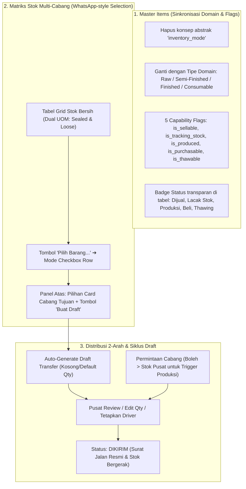

# MASTER EXECUTION PLAN V-4.0
## Master Items Refactor, Multi-Branch Stock Matrix, & 2-Way Draft Distribution Engine

> **Target**: Andaya Group Multi-Tenant Lean ERP  
> **Lead Architect**: Kennan  
> **Executing Agent**: Antigravity  
> **Timestamp**: 25 September 2026 (WITA)  

---

## 🏛️ Prinsip Arsitektur & Aturan Sistem

1. **The Lean Odoo Way**: 1 Core Framework/Engine, Zero Hardcoded Business Logic, Dynamic Capability Flags.
2. **Observability vs Execution Integrity**: Matriks stok adalah panel pemantauan & audit visual. Aksi mutasi fisik wajib melalui siklus dokumen resmi (`Draft` ➔ `Kirim` ➔ `QC Terima`).
3. **Demand Signal for Production**: Cabang satelit boleh meminta stok melebihi stok fisik pusat untuk memicu rencana batch produksi dapur (BOM / Manufacturing).
4. **No Low-Contrast & Soft Backgrounds**: Warna sel matriks menggunakan *soft tint* (hijau/kuning/merah lembut) dengan teks kontras gelap yang mudah dibaca.
5. **Shadcn-First & Zero Full Reload**: Komponen form Shadcn, slide-over drawer kanan, dan pembaruan UI lokal secara reaktif (*optimistic update*).
6. **Bilingual (ID/EN) & Line Icons Only**: Seluruh teks terdaftar di `i18n.ts`, murni icon garis Lucide (tanpa emoji di UI).

---

## 🗺️ Alur Arsitektur Sistem

---

## 📋 Checklist Implementasi Fitur (Step-by-Step)

### ✅ FASE 1: Penyelarasan Master Items & Penghapusan Inventory Mode
- [x] **1.1 Database & Backend Schema**:
  - [x] Hapus ketergantungan kolom/logika `inventory_mode` di tabel `items`.
  - [x] Pastikan 5 capability flags didukung penuh:
    - `is_sellable` *(Dijual di POS / Kasir)*
    - `is_tracking_stock` *(Dilacak di Double-Entry Stock Ledger)*
    - `is_produced` *(Diproduksi di Dapur / Target Hasil BOM)*
    - `is_purchasable` *(Dibeli dari Supplier Luar)*
    - `is_thawable` *(Melalui proses pencairan transit/dapur)*
  - [x] Standardisasi tipe domain `item_type`: `raw_material`, `semi_finished`, `finished_good`, `consumable`, `fixed_tool`.
  - [x] Update struct model Go (`models.Item`), repository, & service handler di `internal/modules/items/`.
- [x] **1.2 Frontend Master Items UI (Drawer & DataTable)**:
  - [x] Refactor Drawer Tambah & Edit Item di `frontend/app/features/items/item-list-module.tsx`:
    - Hapus selector dropdown "Inventory Mode".
    - Ganti dengan 5 Switch Shadcn Capability Flags yang ringkas & to-the-point di Wizard maupun Form Standar.
    - Sematkan icon `HelpCircle` + Tooltip penjelasan ringkas per flag.
  - [x] Update Kolom Tabel `ErpDataTable`:
    - Tampilkan badge kapsul transparan status item: `[Dijual]` `[Lacak Stok]` `[Produksi]` `[Beli]` `[Thawing]`.
  - [x] Sinkronisasi kamus terjemahan bilingual di `frontend/app/lib/i18n.ts`.

---

### ✅ FASE 2: Matriks Stok Multi-Cabang (Observability & Bulk Selection Grid)
- [x] **2.1 Backend Aggregation Endpoint**:
  - [x] Buat endpoint `GET /api/v1/inventory/matrix` dan `GET /api/v1/items/matrix` di Go.
  - [x] Query SQL teroptimasi (< 5ms) mengagregasikan stok **Sealed (Dus/Pack)** & **Loose (Pcs)** per cabang secara horizontal.
- [x] **2.2 Frontend Matriks Stok View**:
  - [x] Buat sub-view terdedikasi `frontend/app/features/inventory/stock-matrix-view.tsx` (Khusus Cabang Utama / Multi-Outlet).
  - [x] Grid horizontal dengan *soft background color* per sel cabang:
    - 🟩 **Hijau Lembut**: Stok Aman (`> min_stock`).
    - 🟨 **Kuning Lembut**: Stok Menipis (`<= min_stock`).
    - 🟥 **Merah Lembut**: Stok Kritis / Habis (`0` / `<= critical`).
  - [x] Format Dual-UOM di tiap sel:
    - Baris 1: `X Dus/Box` *(Sealed / Utuh / Beku)*.
    - Baris 2: `Y Pcs` *(Loose / Eceran / Thawed)*.
  - [x] Header Kolom Cabang Bersih + Popover On-Demand:
    - Klik icon info pada header cabang menampilkan: Alamat fisik, ID Outlet, dan detail tipe cabang.
- [x] **2.3 WhatsApp-Style Row Selection UX & Bulk Draft Panel**:
  - [x] Tombol toggle `[🔘 Pilih Barang untuk Distribusi...]` untuk memunculkan mode checkbox di tabel.
  - [x] Floating Bulk Action Bar di atas tabel:
    - Dropdown / Card pemilihan cabang tujuan pengiriman.
    - Tombol aksi: `[🚚 Buat Draft Distribusi (X Item)]` untuk membuat dokumen draft pengiriman otomatis.
  - [x] Terintegrasi penuh ke dalam Segmented Tab Switcher di `frontend/app/features/inventory/inventory-module.tsx`.

---

### ✅ FASE 3: Backend Engine Distribusi 2-Arah & Siklus Draft Resmi
- [x] **3.1 Skema Database & Migrasi (`stock_transfers`)**:
  - [x] Tambahkan kolom `transfer_type`:
    - `outbound` *(Pasokan Pusat ke Cabang)*
    - `requisition` *(Permintaan Pasokan dari Cabang ke Pusat)*
    - `return` *(Retur Barang dari Cabang ke Pusat)*
  - [x] Standardisasi kolom status transfer:
    - `draft` *(Draf Rencana — Belum ada pergerakan stok)*
    - `pending_approval` *(Khusus Permintaan Cabang — Menunggu konfirmasi pusat)*
    - `in_transit` *(Surat Jalan Terbit, Kurir Berangkat, Stok Pusat OUT)*
    - `received` *(Selesai Diterima Utuh di Cabang Tujuan)*
    - `partial_discrepancy` *(Diterima Sebagian / Ada Kerusakan / Wastage QC)*
    - `cancelled` *(Dibatalkan — Kembalikan stok fisik jika sempat transit)*
  - [x] Update model Go (`models.StockTransfer`), repository, & auto-migration.
- [x] **3.2 Service Logic & Ledger Validation**:
  - [x] Validasi Draft: Status `draft` **TIDAK memicu pergerakan stok** di double-entry ledger (ledger hanya bergerak saat status berubah menjadi `in_transit`).
  - [x] Logika Permintaan Cabang: Mengizinkan `requested_qty` melebihi stok fisik pusat (*Demand Signal for Production*).
  - [x] Logika Persetujuan Pusat: Cabang Utama dapat menyesuaikan `sent_qty` (pas atau sebagian) saat mengirim.
  - [x] Endpoint `POST /api/v1/transfers/bulk-draft` & `POST /api/v1/logistics/distributions/bulk-draft` untuk membuat dokumen draft pengiriman multi-cabang otomatis.

---

### ✅ FASE 4: Frontend Modul Distribusi Resmi (UI & Workflow)
- [x] **4.1 Sub-Modul Distribusi Refactor**:
  - [x] Perbarui `frontend/app/features/distribution/` dengan tab filter status & tipe:
    - Tab: `Semua`, `Draft Rencana`, `Permintaan Cabang`, `Dalam Pengiriman`, `Riwayat Selesai`.
  - [x] Badge Tipe: `[🚚 Pasokan Pusat]`, `[📥 Permintaan Cabang]`, `[↩️ Retur]`.
  - [x] Badge Status Operasional yang ramah & bilingual (`[📄 Draf Rencana]`, `[📥 Menunggu Konfirmasi]`, `[🚚 Dalam Perjalanan]`, `[✅ Diterima]`, `[❌ Dibatalkan]`).
- [x] **4.2 Detail Transfer Drawer & Workflow Actions**:
  - [x] **Mode Draft**: Form edit item, qty, driver/kurir, catatan pengiriman, dan tombol aksi `[🚚 Konfirmasi & Kirim]`.
  - [x] **Mode Review Permintaan Cabang**: Tampilkan perbandingan `Diminta Cabang` vs `Stok Tersedia Pusat` + input `Qty yang Dikirim`.
  - [x] **Mode QC Penerimaan Cabang**: Form input `Qty Diterima Baik` vs `Qty Rusak/Wastage` + catatan selisih.
  - [x] Cetak / Preview Dokumen Surat Jalan Resmi.

---

### ✅ FASE 5: Quality Assurance, Isolasi Tenant & Verifikasi
- [x] **5.1 Backend Verification**:
  - [x] `go vet ./...` lolos 0 error.
  - [x] Uji isolasi tenant: Cabang satelit terfilter otomatis via JWT TenantContext.
- [x] **5.2 Frontend Verification**:
  - [x] `npm run build` lolos 0 error.
  - [x] Uji responsivitas tablet/desktop dan dark/light mode.
  - [x] Uji interaksi seleksi WhatsApp-style dan bulk draft creation.
- [x] **5.3 Sinkronisasi Dokumentasi**:
  - [x] Perbarui [docs/DATA_MODEL.md](file:///D:/laragon/www/Andaya-Group/docs/DATA_MODEL.md).

---

> *Dokumen ini adalah kompas resmi eksekusi sprint Andaya Group Lean ERP.*
